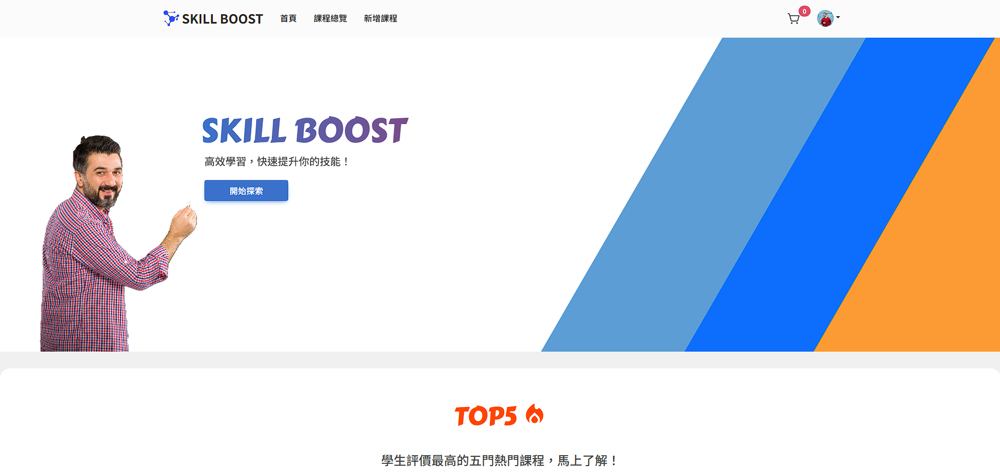
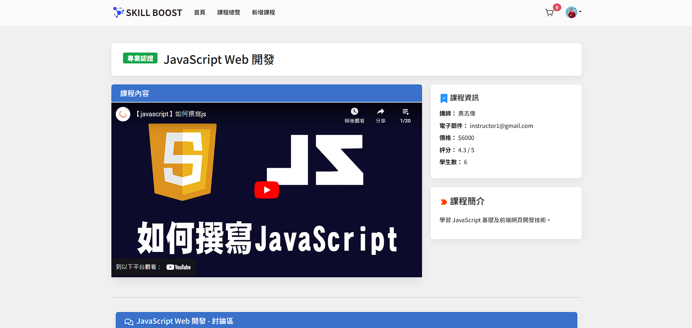
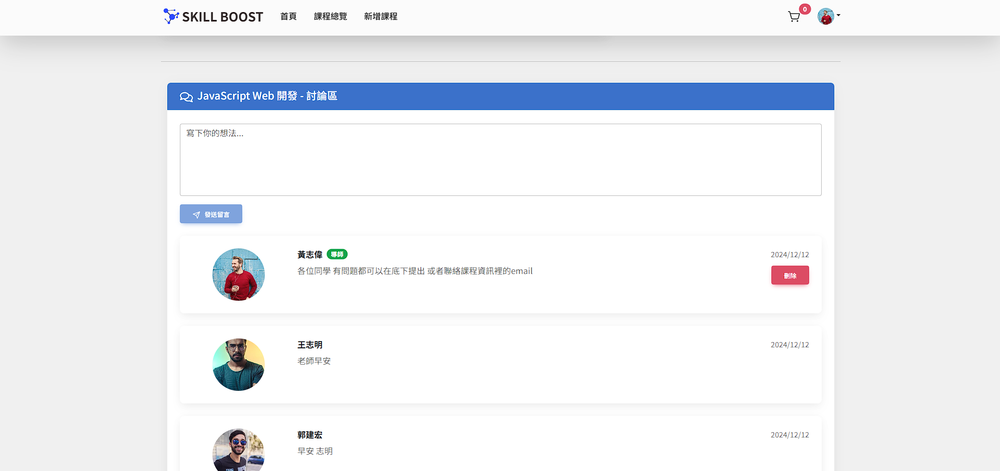

# Skill Boost - Online Course Platform

## 💻 Demo
[Live Demo](https://skill-boost-web.netlify.app/) | [Backend Repo](https://github.com/Darren901/skillboost-backend)

## 🎯 專案簡介
基於 MERN Stack 開發的線上課程平台，提供講師與學生間的線上互動學習體驗。具備會員系統、課程管理、影音播放和線上支付等功能。

## ✨ 核心功能
- 會員系統 (JWT 驗證)
- 課程管理與購買
- 影音播放功能
- 課程評分系統
- 師生互動留言板
- 綠界金流整合

## 🛠 Technologies
### Frontend
- React.js
- React Router
- Bootstrap 5
- SCSS

### Backend
- Node.js / Express.js
- MongoDB / Mongoose
- JWT Authentication

### Others
- RESTful API
- 綠界金流串接
- Netlify / Render / MongoDB Altas 部署

## 📱 Screenshots

## 👤 Demo Account
### 導師帳號
* 帳號：instructor1@gmail.com
* 密碼：instructor1

### 學生帳號
* 帳號：student1@gmail.com
* 密碼：student1
